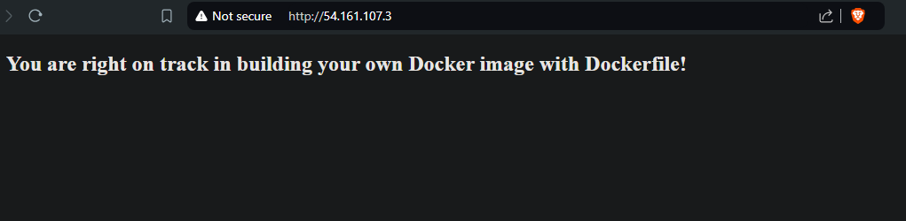

# Build Your Own Docker Image with Dockerfile

## Overview

This project demonstrates how to create and deploy a custom Docker image using a Dockerfile. It is beginner-friendly and provides step-by-step instructions on building a Docker container with a simple HTML page served by Nginx.

**AWS Resources Used:**
- **Amazon EC2:** To host the Docker container.
- **Docker:** To build and run the container image.

Be cautious about potential costs associated with running AWS resources. For more details on AWS pricing, visit the [AWS Pricing](https://aws.amazon.com/pricing/) page.

## Prerequisites

- An AWS account
- Basic knowledge of Docker and HTML
- Docker installed on your local machine
- Access to an EC2 instance

## Project Steps

### Task 1: Sign in to AWS Management Console

### Task 2: SSH into EC2 Instance Using the Key Pair

### Task 3: Create a Dockerfile

- Create a file named `Dockerfile`. This file will be used to define the Docker image configuration. Use the official Nginx image as a base and configure the working directory, copy the HTML file, expose port 80, and set an environment variable.

### Task 4: Create an HTML File

- Create a file named `index.html` with the content of a basic HTML page. This page will be served by Nginx within the Docker container.

### Task 5: Build Your Docker Image

- Build the Docker image using the Dockerfile created earlier.

### Task 6: Launch a Container Using the Image

- Start a Docker container from the newly created image, mapping port 80 of the container to port 80 on your EC2 instance.

### Task 7: Verify the Container

- Open a web browser and access your EC2 instance's public IP address with port 80 (e.g., `http://your-instance-ip:80`) to verify that your web application is running.

## Official Documentation

- [Docker Documentation](https://docs.docker.com/guides/)
- [AWS Documentation](https://docs.aws.amazon.com/)

## License

This project is licensed under the MIT License - see the [LICENSE](LICENSE) file for details.

## Disclaimer

Be mindful of any AWS costs incurred during this project. Ensure to terminate your EC2 instances and other resources when they are no longer needed to avoid unexpected charges.

